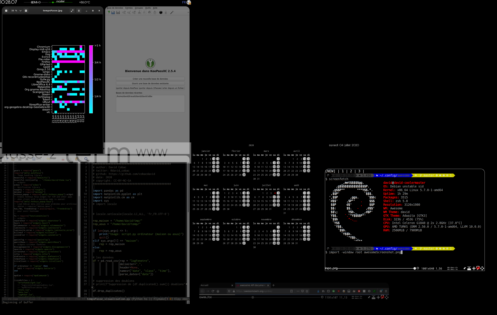

# Disclaimer
All this config is perfect for ME.

## Looking for widgets?
Go into the `widgets` directory, there's another `README.md` file.

## my `rc.lua`

My awesomewm rc file is divided into files (files you could easily
imagine in the original rc file).

If you have a look to them, you have to understand that this config
is intented to fit two PCs: a desktop PC ("desktop") and a laptop
("laptop"), the desktop one is connected to 2 screens (left has a
portrait orientation) and the laptop may be connected from time to
time to a quite low-res interface as a second screen (landscape
only).

## screen setup

First lines of `rc.lua` explains how to setup screens with GDM and
`~\.profile`.

BUT thanks to [this
issue](https://github.com/awesomeWM/awesome/issues/3132), I
discovered xrandr virtual screens features. So I decided to create
two virtual screens on the 2nd monitor with:

``` bash
#!/bin/sh
xrandr --output HDMI-0 --primary --mode 1920x1200 --pos 0x0 --rotate left --output DVI-0 --off --output VGA-0 --mode 1920x1080 --pos 1200x840 --rotate normal
xrandr --setmonitor VIRT-LEFT 1728/538x1080/336+1200+840 VGA-0
xrandr --setmonitor VIRT-RIGHT 192/60x1080/336+2928+840 none
```

Third screen is dedicated to two wibars, in first I display
widgets, second one is used as a gateway to first monitor
(cylindric shape move).

## can it be yours?

My `rc.lua` contains some specific lines you'll have to adjust:

* some lines of the whole config. test whether you're on "laptop"
or not ("asus" is my laptop's hostname).

* `variableDefinitions` contains a lot of variables, for the moment
it's rather a mess... menus, rules and apps (at awesome startup)
depend on it.

* `logicielsIndispensables.lua` is not evaluated. It just contains
a list of software that I use.



(only 2 screens config screenshot
