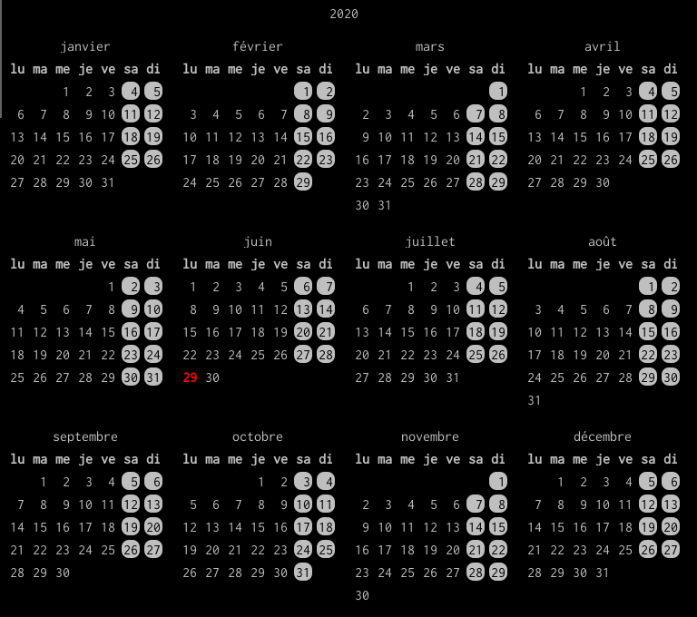

# Some awesome widgets

## for the moment
I'm trying my widgets to be easily usable in any awesome conf.
For the moment, only widgets that documented below responds to this.
Others need my `fonctionsUtiles.lua` lib. to work properly.

# calendar widget
### Installation and usage

If you drop `calendrier.lua` file in a `widgets` directory, you
should consider this command line in your `rc.lua`:

``` lua
calendrier = require("widgets.calendrier")
```

and now you can just attach this calendar to a `wibar` mouse event, e.g.:

``` lua
mywibar:buttons(
    awful.util.table.join(
        awful.button({}, 1,
            function()
                calendrier.afficheCalendrier(calendrier())
            end
        )
    )
)
```

You close the calendar using mouse left-click.



# screen brightness widget
### Installation and usage

If you drop `luminosite_ecran.lua` file in a `widgets` directory, you
should consider this command line in your `rc.lua`:

``` lua
luminosite_ecran = require("widgets.luminosite_ecran")
```

Invoking this line implies that the script tries to retrieve
all screens interfaces using `xrandr`.

Now, you just have to use it as a usual widget, e.g.:

``` lua
mylayout:add(luminosite_ecran())
```


### Bindings

Right-click changes screen interface.

You control simultaneously only one interface at a time.

### Options

You can pass a table as argument containing some custom values for
these keys:
`width`, `startLevel`, `bar_height`, `handle_color_type` (only "gradient" or default: "nuance")

For example:

``` lua
local sLevel = {}
sLevel["HDMI-0"] = 1
sLevel["VGA-0"] = .7
mylayout:add(luminosite_ecran({
    width = 200,
    startLevel = sLevel,
    bar_height = 5,
    handle_color_type = "gradient"
}))
```

Screens interface can be obtained using `xrandr` command.


# infos widget

Just a textbox displaying shell command results (one line).

### Installation and usage

If you drop `infos.lua` file in a `widgets` directory, you
should consider this command line in your `rc.lua`:

``` lua
infos = require("widgets.infos")
```

Now, you just have to use it as a usual widget, e.g.:

``` lua
mylayout:add(infos())
```

### Shell commands

Widget ome with a table of predefined commands (you can comment
them in the source code to disable some of them or all...)

To add a comand, you should use your `rc.lua` to redefine
`infos.commands` table:

``` lua
infos.commands ={"whoami"}
```

or just add a command to the existing ones:

``` lua
table.insert(infos.commands, "whoami")
```

### Bindings

Left-click changes the command used for textbox content

Right-click updates command result in the textbox

### Options

You can pass a table as argument containing some custom values for
these keys:
`width` (default: 150), `font` (default: beautiful.font), `fg` (default:  beautiful.fg_normal)

For example:

``` lua
table.insert(infos.commands, "whoami")
mylayout:add(infos({fg    = "#ff0000",
                    font  = "Inconsolata 15",
                    width = 200
}))
```


