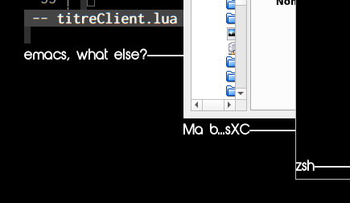
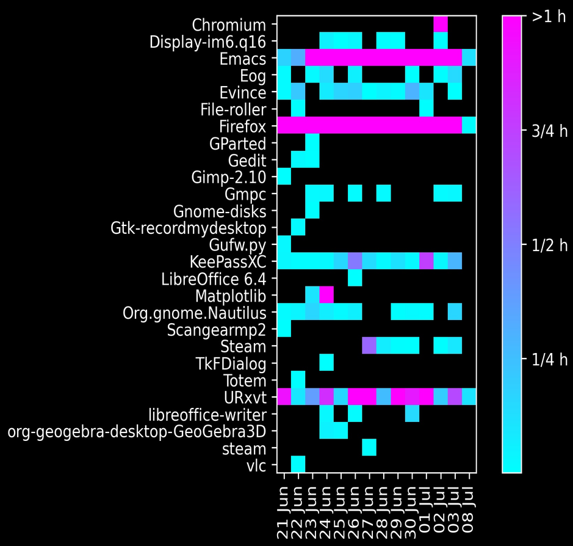
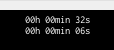

# Some awesome widgets

## for the moment
I'm trying my widgets to be easily usable in any awesome conf.  For
the moment, only widgets that are documented below responds to
this. Others need my `fonctionsUtiles.lua` lib. to work properly.

## widgets for wibars and widgets for titlebars

You'll find `(titlebar)` mention for titlebar widgets i.e. for
client window's titlebars. Others are wibar widgets.


# calendar widget
### Installation and usage

If you drop `calendrier.lua` file in a `widgets` directory, you
should consider this command line in your `rc.lua`:

``` lua
calendrier = require("widgets.calendrier")
```

Now you bind `calendrier()` to a mouse or keyboard event with
something like this:

``` lua
mywibar:buttons(gears.table.join(
    awful.button({}, 1,
       function()
           calendrier()
       end
    ),
    -- other events
    ...
    ...
))

```


### Bindings

You query year before using mouse left-click.

You close the calendar using mouse middle-click.

You query year afetr using mouse right-click.

### Widget screenshot


# screen brightness widget
### Installation and usage

If you drop `luminosite_ecran.lua` file in a `widgets` directory, you
should consider this command line in your `rc.lua`:

``` lua
luminosite_ecran = require("widgets.luminosite_ecran")
```

Invoking this line implies that the script tries to retrieve
all screens interfaces using `xrandr`.

Now, you just have to use it as a usual widget, e.g.:

``` lua
mylayout:add(luminosite_ecran())
```


### Bindings

Right-click changes screen interface.

You control simultaneously only one interface at a time.

### Options

You can pass a table as argument containing some custom values for
these keys:
`width`, `startLevel`, `bar_height`, `handle_color_type` (only "gradient" or default: "nuance")

For example:

``` lua
local sLevel = {}
sLevel["HDMI-0"] = 1
sLevel["VGA-0"] = .7
mylayout:add(luminosite_ecran({
    width = 200,
    startLevel = sLevel,
    bar_height = 5,
    handle_color_type = "gradient"
}))
```

Screens interface can be obtained using `xrandr` command.

### Widget screenshot


# infos widget

Just a textbox displaying shell command results (one line).

### Installation and usage

If you drop `infos.lua` file in a `widgets` directory, you
should consider this command line in your `rc.lua`:

``` lua
infos = require("widgets.infos")
```

Now, you just have to use it as a usual widget, e.g.:

``` lua
mylayout:add(infos())
```

### Shell commands

Widget ome with a table of predefined commands (you can comment
them in the source code to disable some of them or all...)

To add a comand, you should use your `rc.lua` to redefine
`infos.commands` table:

``` lua
infos.commands ={"whoami"}
```

or just add a command to the existing ones:

``` lua
table.insert(infos.commands, "whoami")
```

### Bindings

Left-click changes the command used for textbox content

Right-click updates command result in the textbox

### Options

You can pass a table as argument containing some custom values for
these keys:
`width` (default: 150), `font` (default: beautiful.font), `fg` (default:  beautiful.fg_normal)

For example:

``` lua
table.insert(infos.commands, "whoami")
mylayout:add(infos({fg    = "#ff0000",
                    font  = "Inconsolata 15",
                    width = 200
}))
```

### Widget screenshot


# titreClient widget for clients (titlebar)

Just a textbox displaying client's name

### Installation and usage

If you drop `titreClient.lua` file in a `widgets` directory, you
should consider this command line in your `rc.lua`:

``` lua
titreClient = require("widgets.titreClient")
```

To use this widget, add this at the beginning of your `client.connect_signal("request::titlebars",...` callback function:

``` lua
client.connect_signal("request::titlebars",
    function(c)
       if not c.titre then
          c.titre = titreClient(c)
     end
     -- the function continues, defining your titlebar
     ...
     -- you insert the widget somewhere:
     c.titre,
     ...
  end
)
```

### Options

You can pass a table as an optional argument containing some custom values for
these keys:
`limit` (default is 30 characters), `color` (default is `beautiful.bg_normal`) and `callback` (default is the function `widget.raccourcirTitre` slicing title to limit number of characters used).

For example:

``` lua
if not c.titre then
    c.titre = titreClient(c, {
                              limit = 10,
                              callback = function(titre)
                                  if string.match(titre, "emacs") then
                                      titre = "emacs, what else?"
                                  elseif string.match(titre, "david@") then
                                      titre = "zsh"
                                  else
                                      titre = titreClient.raccourcirTitre(titre)
                                  end
                                  return titre
                              end
                             }
    )
end
```

### Widget screenshot



# tempsPasse widget for clients (titlebar)
### Installation and usage

If you drop `tempsPasse.lua` file in a `widgets` directory, you
should consider this command line in your `rc.lua`:

``` lua
tempsPasse = require("widgets.tempsPasse")
```

Now you can add this to your windows titlebars using callback
function in `client.connect_signal("request::titlebars"`

``` lua
...
tempsPasse(c)
...
```

### Two time indicators
First (upper) indicates total time on this window (client).

Second (lower) indicates current time on this window (client).

### Options

You can pass a table as argument containing some custom values for
these keys:
`width` (default: 100), `font` (default: `beautiful.widget_font_pri`), `size` (actually font size default: 8), `logFile` (default desktop: `${HOME}/.config/awesome/widgets/logFenetreTempsPasse`  and default laptop: `${HOME}/temp/logFenetreTempsPasse`)

### Logs and visualization

This widget comes with a python script
`tempsPasse_visualisation.py` which can generates a heatmap style graph to visualize log records.
This script uses following libraries (that should be installed): `pandas` and `matplotlib`.

To use it just invoke the script with `desktop` in argument (or `laptop`):

``` sh
$ python3 tempsPasse_visualisation.py desktop
```

It produces a `tempsPasse.jpg` file that looks like this:




### Widget screenshot



